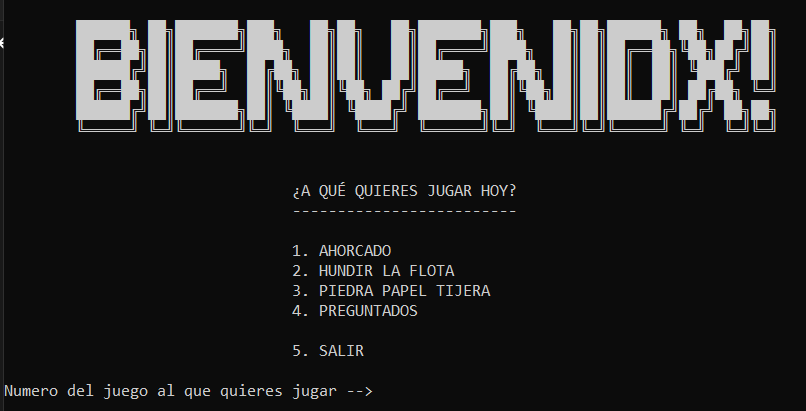

# Proyecto Módulo 1


En este primer proyecto he programdo 4 juegos de los cuales a 2 de ellos (Hundir la flota, Piedra-Papel-Tijera) les he puesto más curro y a los restantes (Preguntados, Ahorcado) he podidos dedicarles menos debido al tiemplo dispobible.

Aun así quedo contento con el resultado y he podido crear un Hundir la flota bastante decente como me pidió Jeancha 😉.

## Guía Uso

Tras descargar el proyecto, se inicia ejecutando el siguiente comando en el direcctorio que se encuentre el archivo **main.py** .
```python
py main.py
```

Después de esto se nos deberá de mostrar un menú como el siguiente:


Ahora solo nos queda disfrutar!!

## Juegos Desarrollados

El menú está programado para mostrar los titulos disponibles según los archivos encontrados en la carpeta **src/**.

Por el momento son:

- **Preguntados** : En este juego tendremos que ir haciendo preguntas al usuario sobre una variedad de temas y el usuario tendrá que ir respondiendo correctamente para avanzar. Las preguntas podrán ser de distintas categorías: cultura general, historia, entretenimiento, actualidad, etc. El usuario ganará el juego si consigue adivinar 10 preguntas seguidas.

- **Ahorcado**: El usuario juega contra la máquina. En este juego el usuario tendrá que adivinar una palabra elegida al azar por la máquina de entre una lista que nosotros definiremos previamente. Cada vez que el usuario se equivoque, mostraremos una nueva parte del personaje del ahorcado en una horca. Si el usuario consigue adivinar la palabra antes de que se le acaben las oportunidades, gana el juego.

- **Piedra-papel-tijera** : en este juego el usuario tendrá que elegir una de las opciones y después la máquina eligirá otra al azar. Gana el primero que gane tres rondas en total. Además la empresa nos ha pedido que, además del juego clásico, el usuario pueda elegir la opción de jugar a **piedra-papel-tijera-lagarto-spock**. 

- **Hundir la flota** : En este juego queremos que el usuario juegue contra la máquina este mítico juego de estrategia. El usuario tiene que tratar de encontrar los barcos de la máquina en un tablero 10x10 antes de que la máquina encuentre los suyos.


## Hacer saber

Dentro de la carpeta **src/**, contamos con la carpeta de **support/** la cual contiene variables con textos los cuales guardamos ahí para no ensuciar el código original y los
cuales usarán sus respectivos juegos.

Debido al tiempo, hay algunas validaciones que no están hechas dentro de los juegos y en algunos, la vualta al menú no funciona del todo correctamente.

El archivo **prueba.py** no sirve para nada. Yo lo usé para desarrollar partes de la lógica pero nada más.


